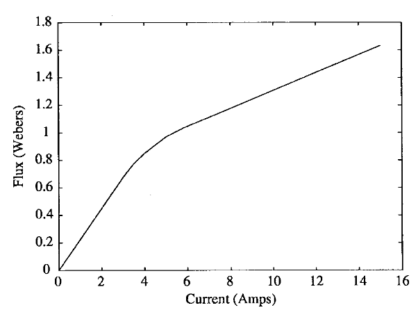
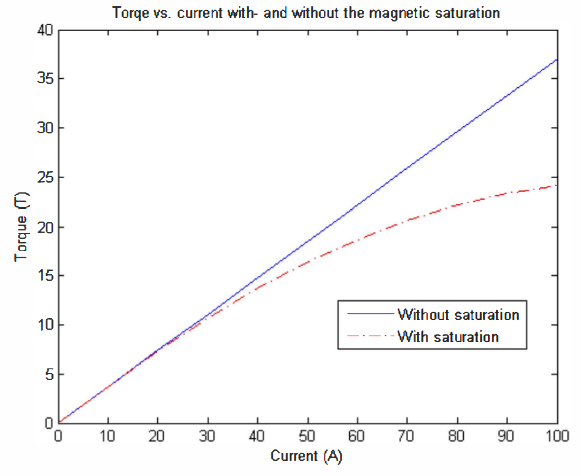

# DC MOTOR CONTROL REPOSITORY

Repo for DC motor control using ESP32 and DC6V210RPM motor

# DC motor UMA platform

## Connections

### External LED

#### Digital signal

#### PWM 

### H-bridge

### Motor

#### PWM

### Encoder

#### Measure position with Interrupts

#### Measure velocity by discrete derivative

# Modelling 

## Theoretical model

## Parameter identification

## System Identification

## Non-linearities

There are several sources of non-linearities that are not included in the theoretical model. Some of the most important are depicted below

### Magnetic Saturation

[Magnetic Saturation](https://en.wikipedia.org/wiki/Saturation_(magnetic)) is the state reached when an increase in applied external magnetic field $H$ cannot increase the magnetization of the material further, so the total magnetic flux density $B$ more or less levels off.

A DC motor produces torque by forcing magnetic flux to interact with armature current. As long as the magnetic material can “carry” more magnetic flux, increases in current produce proportional increases in torque.

Hence we have the ideal linear model:

$$
\tau = k_t ​I_a​
$$

where $k_t$ is the motor torque constant, as $k_t = k_a \phi$, and we assume that the flux $\phi$ is constant, and $k_a$ is the armature constant $k_a = \frac{E_a}{\phi \omega}$.

However, the magnetic material cannot magnetize indefinitely. Beyond a certain point, additional current produces much smaller increases in magnetic flux. I.e., it saturates.

At high armature currents, the magnetic circuit saturates and flux $\phi$ is no longer constant, instead, it depends on the current $\phi(I_a)$. This illustrated in the following figure from [this paper](https://doi.org/10.1109/87.761052)

Hence, torque $\tau$ is no longer proportional to current $I_a$​, resulting in the real, non-linear case:

$$
\tau = k_t ​(\phi(I_a)) I_a​ = \tau = k_t ​(I_a) I_a​ 
$$

This is illustrated in the following figure from [this paper](https://doi.org/10.1109/ECTICON.2011.5947918) that explains this phenomena.

Generally, DC motors operate in the unsaturated region with the rated current, meaning that the linear assumption is valid in most of the cases. But if the motor is overloaded, the current may increase beyond the rated current, leading to the magnetic saturation. Thus, for modelling and control purposes it is important to not overload the motor.

### Back-EMF non-linearity

### Dead-zone

### Non-linear drivers

### Friction

### Backlash

# Motor Dynamics (Transient response)

## Position response

## Velocity response

# Control

## Continuous (analog) control

### Position control

#### P control

#### PID control

### Velocity control

#### P control

#### PID control

## Discrete (digital) control

### Position control

#### P control

#### PID control

### Velocity control

#### P control

#### PID control

